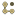
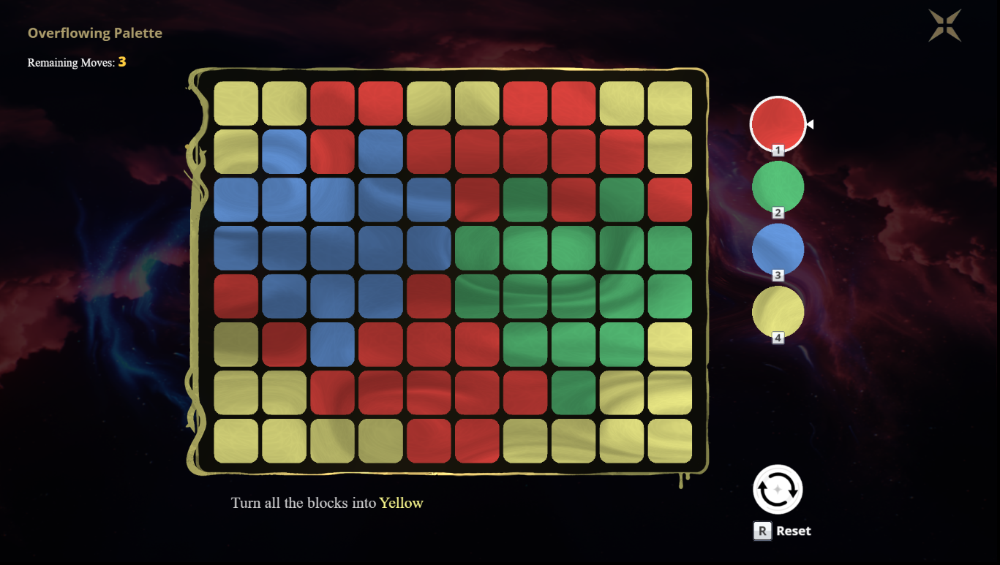

# </img> Overflowing Palette

### Live: https://xirtelan.github.io/overflowing_palette/
### Alt live: https://xirtelan.itch.io/overflowing-palette
showcase: https://youtu.be/9FPFLpCEiQI

- [General](#introduction)
- [Usage](#usage)
  - [Level Selection](#level-selection)
    - [Import Level](#import-level)
  - [Level Editor](#level-editor)
    - [Controls](#controls)
    - [Export Level](#export-level)
  - [Options](#options)
- [Customization](#customization)
  - [Base](#base)
  - [Config (Offline)](#config-offline)
    - [Colors](#colors)
    - [Add Levels](#add-levels)
    - [UI](#ui)
  - [Code](#code)
    - [Shader](#shader)
- [Installation/Building for Offline](#installation)

Plans for next update (1.1 ETA 15-16 march) 

Redo the options menu—more settings, plus a couple of background choices.

A new mode in the levels will include a mechanic called "Tools." These will have limited uses but won’t consume moves. Right now, this mainly consists of different ways to swap tiles.

Zen Random—still working out the details, but the idea is a randomly generated board without a move counter.

Level Preview will show also grid size, author (if it's not mine) , cleared time ( for cleared levels)

Level Preview for import level

New UI for export levels


## General



Project: Recreating the puzzle *Overflowing Palette* from *Wuthering Waves* as an HTML5 web game using Phaser 3.

### Features:
- All levels from the game  
- Level Editor (export/import)  
- Levels with different grid sizes  
- More available colors  
- Customization  

### Stack:
Vite, Phaser 3

## Usage 

### Level Selection


#### Default - Levels from the Game 


Levels are separated by regions.  
**Green background** - Cleared stages  
**Note:** Cleared levels are saved in the browser's localStorage.

### Import Levels  

## Level Editor


The editor is quite straightforward. Choose the grid size you want.  
Although the values are limited from **2 to 100**, fields larger than **25x25** can be hard to use and may take some time to load.

- **Fill Color** - Determines the color used to fill the grid.


You can use **box selection** to select multiple cells at once by clicking and dragging a selection area over them (calculated at the cell center).

## Export Level


- **Copy STRING** - Used for in-game import.
- **Copy JSON** - Used for offline addition to the levels info JSON file.

### Options
  

  NOTE: After any changes refresh browser page \
  Colors - I think everything is clear, BUT keep in mind: you will only change the colors. \
  The names will stay the same. So, if you swap colors (red and blue, for example), the game will still show the name 'Red' for the 1st color and 'Blue' for the 3rd color if they are the targets.

  Simple colors - remove any animation/shades etc on cells. 
  Stronger higlight - cell on mouse over will be more visible. 


## Installation

### From Source Code

```sh
pnpm install
```

```sh
pnpm run dev
```

### Build

```sh
pnpm run build
```

After building (or if using a prebuilt version), you will need a local server.

### Options for Running a Local Server:

- **Use Live Server (VS Code Extension)**  
  - Right-click the `index.html` file in Visual Studio Code and select **Open with Live Server**.  
- **Use `http-server` module from Node.js**  
  - Install via npm, then run:  
    ```sh
    http-server .
    ```
- **Use `http.server` from Python**
- **Use a WAMP (or LAMP) server**
